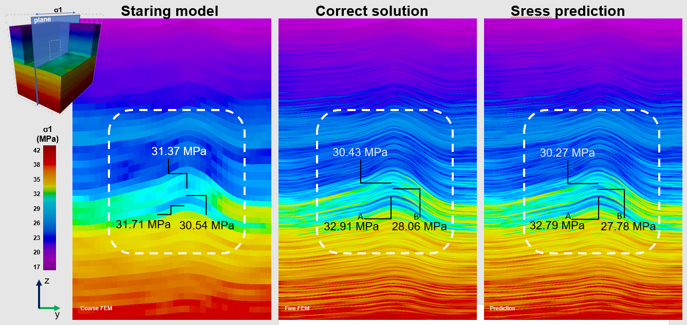

# Deep Learning for Uncertainty in Stress Modelling: (In progress)

## The project 
This project proposes a methodology to estimate stress in the subsurface by a hybrid method 
combining finite element modelling and neural networks. This methodology exploits the idea 
of obtaining a “multi-frequency solution” in the numerical modelling of systems whose behaviour
 involves a wide span of length scales. One “low-frequency” solution is obtained via inexpensive 
 finite element modelling at a coarse scale. The second solution provides the fine-grained 
 details introduced by the heterogeneity of the free parameters at the fine scale. 
 
 This “high-frequency” solution is estimated via neural networks pre-trained with partial 
 solutions obtained in high-resolution finite-element models. When the coarse finite element 
 solutions are combined with the neural network estimates, the results are within  a 2% 
 of error of the results that would be computed with high-resolution finite element models.
 The  paper discusses the benefits and drawbacks of the method and illustrates its applicability 
 via a worked example.
 
## Draft paper
 <a href="https://drive.google.com/file/d/1vew6OoRC5vxERwdCl27J2xvy-yxNpib0/view?usp=sharing">
Physics-Informed Neural Networks for Multi-Scale Stress Modelling in Geological Structures
</a>
 
 
 
## Methodology   

<p>Neural network used. Four independent 3D valid convolutions using a (2,2) kernel  
operated on stress and mechanical properties in 3D. Stress was sampled from coarse 
cells and E,ν were sampled from the high-resolution model. The outputs of the 
convolutions were flattened and merged with  pressure and overburden load and passed 
to a stage of  fully connected layers (see paper)</p>

## Results  

<p>Effective minimum principal stress σ_1. A: Cross horizontal section of the coarse 
model used for training. B: Cross horizontal section of the correct solution. 
C: Projections along a vertical line and zoomed-in view. Filled curve corresponds 
to the correct solution and the dashed line to the coarse model used for training. 
</p>
  
## Details
### Data Processing. Workflow step 1


The data comes straingth from Petrel software platform. The file format is GRDCL. The data is in good shape so little manipulaion is needed. 
The parsing converts the information inside the files into several pandas dataframes for easy processing. The parser in itself just have one 
static method that receives as a string the input file and returns a data frame:

```python
class EclipseFileParser:
    
    @staticmethod 
    def PetrelEclipseKeywords_to_pandas( file_name :str  )->pd.DataFrame:
    ...
```

This is called near the top of the notebook 

```python
data_raw = EclipseFileParser.PetrelEclipseKeywords_to_pandas( data_file );
```

Although the data is in good shape, some minimal checking and processing is still due. 
Here is one example of the code in the notebook performing a basic check. 

```python

(...)
eff=[ data_raw[col] for col in data_raw.columns if "POISS" in col ]
print( f"Any out-of-range Poisson's ratio? { is_condition(eff, lambda item: any(item <0.1) or any(item >0.5)  ) } ")
(...)

```
Finally the code stores the pre-processed data as a feather.
```python
 %time data_raw.to_feather(output_file_name)
```

Once all the files are stored as feathers, the workflow continues with extra pre-processing steps before the data 
is in the format needed for the neural network training. 

#### The full workflow is really long. It will be published here little by little. 
